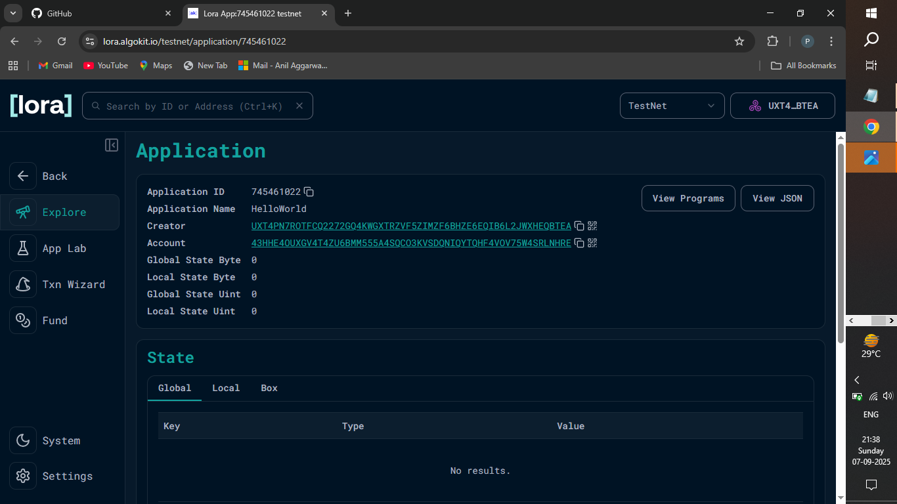

# 🛒 Grocery List dApp on Algorand


https://lora.algokit.io/testnet/application/745461022

## 📌 Project Description
This project is a **beginner-friendly decentralized application (dApp)** built on the **Algorand blockchain**.  
It demonstrates how to build and deploy a simple **smart contract in TypeScript** that manages a grocery list on-chain.  

The purpose of this project is to help newcomers understand the basics of:
- Writing Algorand smart contracts  
- Storing and retrieving data on-chain  
- Building a simple, real-world dApp example  

---

## ✅ What it does
- Allows users to **add grocery items** (with name and quantity) to a shared list stored on the Algorand blockchain.  
- Lets anyone **view the current grocery list**.  
- Provides a **clear/reset function** to empty the list.  

This makes it a great starting point for learning how blockchain can handle simple real-world use cases.

---

## ✨ Features
- **Add Item**: Add an item and quantity (e.g., "Apples (2kg)")  
- **View List**: Retrieve the current grocery list from the blockchain  
- **Clear List**: Reset the grocery list to empty  
- **Beginner-Friendly Code**: Written in TypeScript with clear structure for easy learning  
- **Algorand Powered**: Fast, secure, and eco-friendly blockchain backend  

---

## 📜 Smart Contract Code
```typescript
import { Contract } from '@algorandfoundation/algorand-typescript'
import { GlobalState } from '@algorandfoundation/algorand-typescript'

export class GroceryList extends Contract {
  // Store grocery list items in global state (as a single string for simplicity)
  groceryList = GlobalState<string>({
    key: "groceryList",
    initialValue: ""
  })

  // Add an item (title + quantity)
  AddItem(item: string, quantity: string): string {
    // Append new item to the existing list
    const currentList = this.groceryList.value
    const newEntry = `${item} (${quantity}), `
    this.groceryList.value = currentList + newEntry

    return item
  }

  // Clear the list
  ClearList(): string {
    this.groceryList.value = ""
    return "List cleared!"
  }

  // Get current list
  GetList(): string {
    return this.groceryList.value
  }
}


